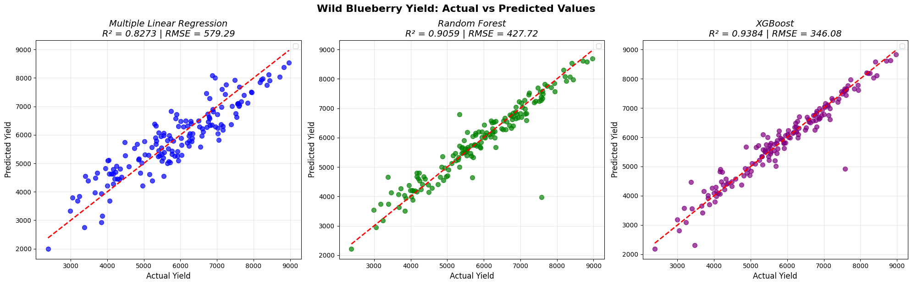
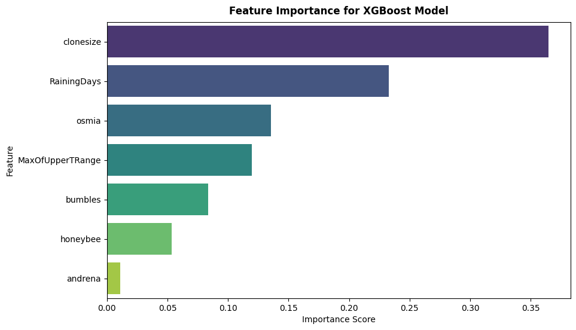

# **🍇 Wild Blueberry Yield Prediction**

A machine learning project to predict the yield of wild blueberries (in kg/ha) based on pollinator density and environmental data. This project analyzes a simulated dataset to build and evaluate several regression models, ultimately identifying **XGBoost** as the most accurate predictor.

This analysis closely follows the methodology of the research paper: **Wild blueberry yield prediction using a combination of computer simulation and machine learning algorithms** published on [Science Direct's Computers and Electronics in Agriculture Journal](https://www.sciencedirect.com/science/article/abs/pii/S016816992031156X).

---

## **🎯 Project Overview**

The most challenging task in agriculture is accurately predicting crop yield. This project aims to develop a robust predictive model for wild blueberry yield using a dataset generated by the **Wild Blueberry Pollination Simulation Model.**

The primary goals are:
* To clean and prepare the simulated data for modeling.
* To build, train, and evaluate multiple machine learning regression models.
* To identify the best-performing model based on **Root Mean Square Error (RMSE)** and **Coefficient of Determination ($R^2$)** metrics.
* To determine the most significant factors (bee species, weather, plant size) that influence blueberry yield.

The project successfully demonstrates that a machine learning model, specifically **XGBoost**, can achieve high accuracy (R² of 0.938) in predicting yield, aligning perfectly with the source research.

---

## **📂 Dataset Source & Structure**

The dataset `WildBlueberryPollinationSimulationData.csv` is not a field-collected data. It is a curated dataset generated by a scientifically validated, spatially-explicit computer simulation program that models the complex interactions between plants, bee pollinators, and weather. It has been validated by the field observation and experimental data collected in **Maine USA and Canadian Maritimes** during the last 30 years.

* **Source:** Wild Blueberry Pollination Simulation Model.
* **Size:** 
    - 777 Samples 
    - 18 Features (Before Data Cleaning).
* **Target Variable:** `yield` (Continuous variable in kg/ha).  

---

## **⚙️ Methodology**

This project follows a standard machine learning workflow from data ingestion to model deployment:

1.  **Data Ingestion:** The `WildBlueberryPollinationSimulationData.csv` is loaded into a pandas DataFrame (df).
2.  **Data Cleaning:**
    * **Irrelevant Columns** (`Row#`) are dropped.
    * **Data Leakage** is prevented by dropping outcome-based columns (`fruitset`, `fruitmass`, `seeds`) which are results of pollination, not predictors.
3.  **Feature Selection:** The DataFrame is reduced to the 7 key predictors identified in the research paper and the target variable `yield`.
    -  `clonesize`: The average blueberry clone size in the field ($m^2$).
    -  `honeybee`: Honeybee density ($bees/m^2/min$).
    -  `bumbles`: Bumblebee density ($bees/m^2/min$).
    -  `andrena`: Andrena bee density ($bees/m^2/min$).
    -  `osmia`: Osmia bee density ($bees/m^2/min$).
    -  `MaxOfUpperTRange`: Maximum upper-temperature range during the bloom season (°F).
    -  `RainingDays`: Total number of days with precipitation during the bloom season.

4.  **Train-Test Split:** The dataset is split into training (80%) and testing (20%) sets to evaluate model performance on unseen data.
    - **Training Dataset Size:** 621 Observations
    - **Testing Dataset Size:** 156 Observations

5.  **Model Training:** Three different regression models are trained on the training data:
    - Multiple Linear Regression (Baseline)
    - Random Forest Regressor
    - XGBoost Regressor

6.  **Model Evaluation:** All models are evaluated on the test set using $RMSE$ and $R²$ metrics to compare their predictive accuracy.

7.  **Model Persistence:** The best-performing model (XGBoost) is saved to a file (`blueberry_yield_model.joblib`) using `joblib`. This allows the model to be loaded and used for predictions in the future without retraining.

---

## **✅ Results**

The models' performance on the unseen test data was compared. The **XGBoost Regressor** was the clear winner, providing the lowest error and the highest accuracy, which perfectly replicates the findings of the source study.

### **Model Comparison**

As shown in the bolded row, the **XGBoost** model's predictions are, on average, only off by ~346 kg/ha and can explain **93.83%** of the variation in wild blueberry yield.  

| Model | RMSE (kg/ha) | R² (%) |
| :--- | :--- | :--- |
| MLR | 579.28 | 82.73% |
| RF | 427.71 | 90.58% |
| **XGBoost** | **346.08** | **93.83%** |

**Root Mean Square Error ($RMSE$):** The average prediction error (lower is better).

**Coefficient of Determination ($R²$):** The proportion of variance in yield that the model can explain (higher is better).

The below plot shows each model's predicted yield vs. the actual yield on the unseen test data. The tight cluster around the red "perfect fit" line indicates high accuracy.



---

## **🔬 Feature Importance**

We can inspect the trained XGBoost model to see which features it found most important for making its predictions. This aligns with the paper's findings on the key drivers of yield.



The top three key factors, in descending order of importance, are:
1.  **RainingDays:** Precipitation has the single largest impact on yield.
2.  **clonesize:** The spatial arrangement and size of the plants is the second most critical factor.
3.  **osmia:** The density of *Osmia* bees, a native pollinator, is the most important bee species.

---

## **🚀 How to Run the Project**

To replicate this analysis on your local machine, please follow these steps:

1.  **Clone the Repository:**
    ```bash
    git clone [https://github.com/YOUR_USERNAME/YOUR_REPO_NAME.git](https://github.com/YOUR_USERNAME/YOUR_REPO_NAME.git)
    cd YOUR_REPO_NAME
    ```

2.  **Create a Virtual Environment:**
    ```bash
    python -m venv venv
    ```

3.  **Activate the Environment:**
    * On Windows:
        ```bash
        .\venv\Scripts\activate
        ```
    * On macOS/Linux:
        ```bash
        source venv/bin/activate
        ```

4.  **Install Required Libraries:**  
    `requirements.txt` file is included in the repo.  
    Run:
    ```bash
    pip install -r requirements.txt
    ```

5.  **Run the Jupyter Notebook:**  
    Open the project in VS Code or start Jupyter:
    ```bash
    jupyter notebook Wild_Blueberry_Yeild_Prediction.ipynb
    ```
    You can then run all cells to see the analysis and model training in real-time.

---

## **🧠 Conclusion & Key Takeaways**

**✅ Successful Prediction:** This project successfully demonstrates that a machine learning model can accurately predict wild blueberry yield using a small set of environmental and pollinator-based features.  

**🔝 XGBoost Superiority:** The XGBoost model significantly outperformed both Linear Regression and Random Forest, confirming its effectiveness for tabular, simulation-based data.  

**📈 Data-Driven Insights:** The model's feature importance validates the findings of the research: **weather** (`RainingDays`) and **plant spatial structure** (`clonesize`) are the most dominant factors influencing yield.  

**💻 Simulation is Viable:** This project proves that high-quality, simulated data can serve as a robust substitute for costly and difficult field data collection when training effective machine learning models.

---

## **📞 Contact & Collaborate**

For feedback or collaborations, please feel free to reach out:

**👩🏻‍💻 Author:** Syeda Hadiqah Fatima  
**📧 Email:** hadiqah.fatima02@gmail.com  
**🔗 LinkedIn:** [linkedin.com/in/s-hadiqah-f/](https://www.linkedin.com/in/s-hadiqah-f/)  
**🌐 GitHub:** [Syeda-Hadiqah08](https://github.com/Syeda-Hadiqah08)

---

> ***Without data, you're just another person with an opinion***  

---
